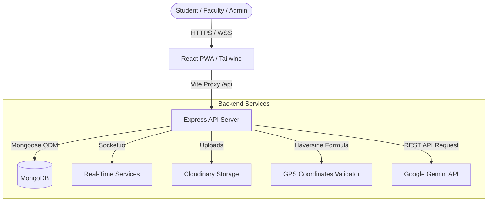

# 🏫 CampusHub: Smart Campus Management PWA

CampusHub is a premium, feature-rich **Smart Campus Management Progressive Web Application (PWA)** designed to streamline day-to-day academic operations, foster student-faculty collaboration, and digitize university processes. Built using the **MERN (MongoDB, Express, React, Node.js) Stack** with **TypeScript**, it incorporates geofenced attendance tracking, real-time communications, placement and marketplace modules, and an interactive Gemini-powered AI Assistant.

---

## 🚀 Core Features

### 📍 1. Geofenced QR-Based Attendance
*   **Time-Decaying QR Sessions:** Faculty members generate a dynamic QR code that expires and updates every 30 seconds to prevent attendance fraud.
*   **GPS Verification:** Utilizing the **Haversine formula**, the backend verifies that the student's coordinates are within a strictly defined **30-meter radius** of the classroom before registering attendance.
*   **Live Metrics:** Interactive dashboards display student attendance ratios, weekly breakdowns, and compliance stats using **Chart.js**.

### 🤖 2. Personalized Gemini AI Campus Assistant
*   **Context-Aware Chat:** Integrated with Google's **Gemini 3.5 Flash** API. The assistant automatically formats its responses according to the logged-in user's role (Student, Faculty, Admin), name, department, and academic semester.
*   **Offline Mode:** Seamless fallback capability ensures that if API keys are unconfigured, the AI operates in a simulated local-helper mode to explain core platform functions.

### 💼 3. Placements & Internships Portal
*   **Recruitment Drives:** Training & Placement Officers (TPOs) and Admin users can post detailed job and internship profiles (CTC package, location, eligibility, deadline).
*   **Application Tracking System:** Students upload resumes directly (stored in **Cloudinary**) and track their candidacy status (`applied` ➔ `shortlisted` ➔ `technical round` ➔ `interview` ➔ `selected`/`rejected`) in real-time.

### 🛍️ 4. Student Marketplace (Peer-to-Peer)
*   **Campus Buy & Sell:** A secure listing marketplace for students to list used textbooks, calculators, lab coats, and academic supplies.
*   **Admin Approval Flow:** Listings default to a *Pending* state and only appear on the public feed once approved by an administrator to filter out spam.

### 📚 5. Study Materials & Notes Sharing
*   **Multi-Format Storage:** Faculty and students can upload notes, lecture slides, and past papers.
*   **Download Tracking:** Monitors notes downloads and categorizes study resources by department and semester.

### 📢 6. Dynamic Events & Targeted Announcements
*   **RSVP System:** Faculty/Admins publish campus workshops, technical fests, or seminars with one-click student RSVP management.
*   **Role-Targeted Alerts:** Notifications and announcements targeted to specific roles or departments.

---

## 🛠️ Tech Stack

| Layer | Technologies Used |
| :--- | :--- |
| **Frontend** | React 18, Vite, TypeScript, Tailwind CSS, TanStack React Query v5, Framer Motion, React Router DOM, Chart.js, Lucide Icons |
| **Backend** | Node.js, Express, TypeScript, Socket.io, Multer, Zod (Schema Validation), Helmet, Express Rate Limit, bcryptjs |
| **Database & Media** | MongoDB, Mongoose ODM, Cloudinary (File Storage) |
| **AI Integration** | Google Gemini API (`gemini-3.5-flash`) |

---

## 📊 System Architecture



---

## ⚙️ Project Structure

```
CampusHub/
├── backend/                  # Express & MongoDB Server
│   ├── src/
│   │   ├── config/           # Database configuration
│   │   ├── controllers/      # Route logic handlers
│   │   ├── middlewares/      # JWT validation, error handling, rate limiting
│   │   ├── models/           # Mongoose schemas (User, Job, Attendance, lostFound, etc.)
│   │   ├── routes/           # API routes definitions
│   │   ├── services/         # Third-party integrations (Gemini AI, Cloudinary)
│   │   ├── utils/            # Helper functions (Haversine formula, QR utils)
│   │   └── validation/       # Zod verification schemas
│   └── tsconfig.json
│
└── frontend/                 # React & Vite client
    ├── src/
    │   ├── components/       # Reusable UI elements (Navbar, Sidebar, Charts)
    │   ├── context/          # Authentication & Theme contexts
    │   ├── layouts/          # Dashboard layouts
    │   ├── pages/            # View pages (Attendance, Marketplace, AI Assistant, etc.)
    │   └── services/         # Socket connection and API clients
    ├── index.html
    └── tailwind.config.js
```

---

## 🔧 Installation & Setup

### Prerequisites
*   Node.js (v18.x or above)
*   npm or yarn
*   MongoDB Instance (Atlas or Local)
*   Cloudinary Account (for resume/product image uploads)
*   Google AI Studio API Key (for Gemini Chatbot)

### Step 1: Clone the Repository
```bash
git clone https://github.com/MaajidCoder/CampusHub-Smart-Campus-Management-Progressive-Web-Application-PWA-.git
cd CampusHub-Smart-Campus-Management-Progressive-Web-Application-PWA-
```

### Step 2: Backend Setup
1. Navigate to the backend directory:
   ```bash
   cd backend
   ```
2. Install dependencies:
   ```bash
   npm install
   ```
3. Create a `.env` file using the template:
   ```bash
   cp .env.example .env
   ```
4. Update the values in `.env` with your credentials:
   *   `MONGO_URI`: Your MongoDB database string
   *   `JWT_ACCESS_SECRET` & `JWT_REFRESH_SECRET`: Secure random strings
   *   `CLOUDINARY_CLOUD_NAME`, `CLOUDINARY_API_KEY`, `CLOUDINARY_API_SECRET`: From your Cloudinary dashboard
   *   `GEMINI_API_KEY`: From Google AI Studio
5. Build and run the server in development mode:
   ```bash
   npm run dev
   ```
   The backend will start on `http://localhost:5000`.

### Step 3: Frontend Setup
1. Navigate to the frontend directory:
   ```bash
   cd ../frontend
   ```
2. Install dependencies:
   ```bash
   npm install
   ```
3. Start the client dev server:
   ```bash
   npm run dev
   ```
   The application will start on `http://localhost:5173`. Open your browser and navigate to this address.

---

## 🔒 Security Measures
*   **Secure Cookies:** JWT access tokens and refresh tokens are handled securely.
*   **API Protection:** Custom rate-limiters applied to sensitive endpoints (e.g., authentication, AI queries).
*   **Header Hardening:** Integrated **Helmet** middleware to secure Express header parameters.
*   **Request Sanitization:** Request schemas validated using **Zod** preventing dirty database entries.

---

## 📄 License
Distributed under the MIT License. See `LICENSE` for more information.

---

## 🤝 Contact
**Maajid Hazar** - [maajidhassan2006@gmail.com](mailto:maajidhassan2006@gmail.com)  
Project Link: [https://github.com/MaajidCoder/CampusHub-Smart-Campus-Management-Progressive-Web-Application-PWA-](https://github.com/MaajidCoder/CampusHub-Smart-Campus-Management-Progressive-Web-Application-PWA-)
